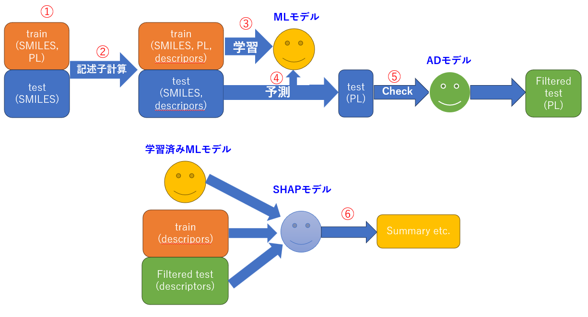

# Molecule PL Wavelength Prediction


SMILESデータから記述子を計算し、分子の発光波長（Photoluminescence wavelength, PL）を予測するための機械学習パイプラインです。  
記述子計算→EDA→モデル学習・汎化性能評価→テストデータ予測→AD適用→SHAPという流れになっています。 



Qiita記事:  
- [化学×AI: 機械学習でPL波長を予測する（第1回：記述子計算とデータ可視化）](https://qiita.com/Osarunokagoya/items/cc0f79e3a3d959de8635)  
- [化学×AI: 機械学習でPL波長を予測する（第2回：予測モデルの構築）](https://qiita.com/Osarunokagoya/items/fbf618c29ba6c0f85253)  
- [化学×AI: 機械学習でPL波長を予測する（第3回：出力結果の妥当性判断）](https://qiita.com/Osarunokagoya/items/d822d0516b10f9ffa20e)  

---

## セットアップ方法

### 1. 簡単版（pip）
下記コマンドを**ターミナル**で入力・実行し、ご自身の環境に必要なライブラリをインストールしてください。
```bash
pip install -r requirements.txt
jupyter lab
```

### 2. 完全再現版（Docker/DevContainer）
VSCodeとDockerを使用している方は、こちらを使用していただくと完全再現ができます。GPU使用推奨ですが、NN以外の予測モデルはCPUで十分動きます。
- `.devcontainer/` ディレクトリに Dockerfile と environment.yml を同梱しています  
- VS Code Dev Containers を利用すると GPU 環境込みで再現可能です  

---

## データ
- 入力: `data/material_data.csv`  
- 記述子出力: `outputs/descriptors/*.csv`  
- 予測結果: `outputs/predictions/*.csv`  

`material_data.csv` に分子構造を表すSMILESとその材料に対応するPL波長が載っています。     

※ データは特許や論文から集めたもので、ソルバトクロミズムの影響は無視しているため、ばらつきがあることをご承知おきください。あくまで機械学習パイプラインの勉強用です。

---

## ノートブックの流れ
**1.preparation.ipynb**  
- データ読み込み、SMILES 構造の簡単な前処理を行います。 
- 記述子の計算（RDKit, Mordred, 3D）

**2.EDA.ipynb**  
- データの可視化・統計解析を行います。

**3.Regression.ipynb / 4.Regression_CV.ipynb**  
- モデル構築、**3.Regression.ipynb** はホールドアウト, **3.Regression_CV.ipynb** は交差検証により、汎化性能の評価を行います。

**5.predict_all.ipynb / 5.predict_NN**  
- テストデータ予測、**all**が決定木モデル用で、**NN**がニューラルネットワークを使用したものになります。
- Applicability Domain (AD) を考慮した判定を行います。

**6.SHAP.ipynb**  
- モデル解釈（SHAP値による特徴量重要度の可視化）を行います。

---

## 使用技術
- Python (3.9)  
- RDKit, Mordred  
- scikit-learn, LightGBM, XGBoost  
- Optuna（ハイパーパラメータ探索）  
- SHAP（解釈可能性）  
- PyTorch

---

## ライセンス
本リポジトリは研究・教育目的での利用を想定しています。