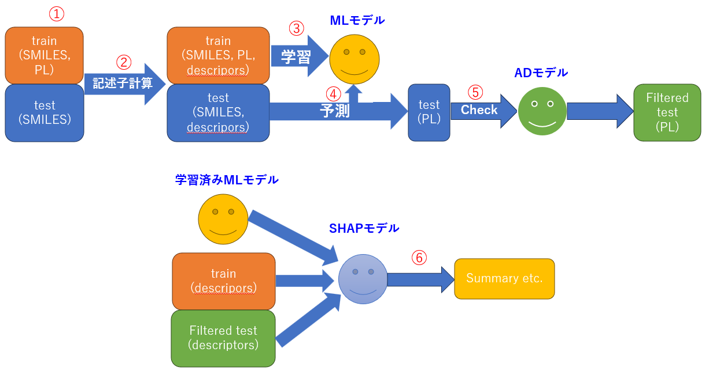
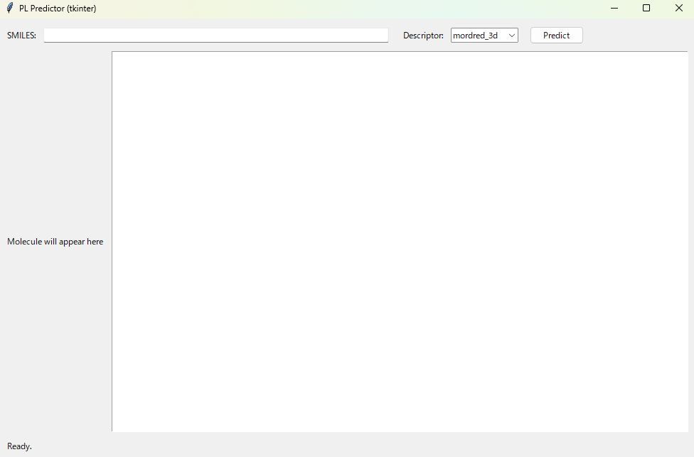
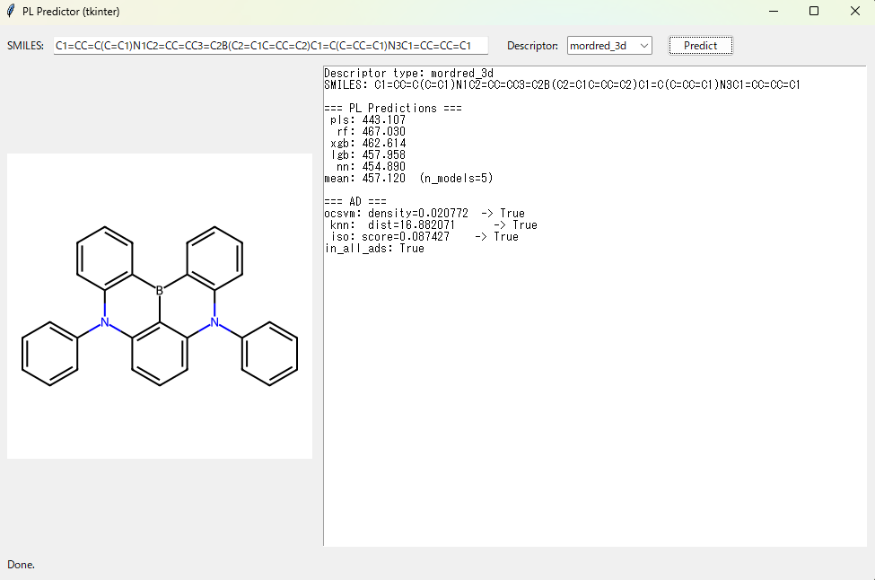

# Molecule PL Wavelength Prediction
SMILES から分子記述子（RDKit / Mordred）を計算し、分子の発光波長（Photoluminescence wavelength, PL）を予測するための機械学習パイプラインです。 

本リポジトリは

**A. 「Notebookで記述子計算からモデル構築・予測まで一連の流れを実装」**      
**B. 「SMILESを入力すれば予測波長が出力されるGUIソフト」** 

の2本立てです。**A**の大まかな流れは↓の通りです。



Qiita記事にも記載していますので、こちらも参考にしてください。
- [化学×AI: 機械学習でPL波長を予測する（第1回：記述子計算とデータ可視化）](https://qiita.com/Osarunokagoya/items/cc0f79e3a3d959de8635)  
- [化学×AI: 機械学習でPL波長を予測する（第2回：予測モデルの構築）](https://qiita.com/Osarunokagoya/items/fbf618c29ba6c0f85253)  
- [化学×AI: 機械学習でPL波長を予測する（第3回：出力結果の妥当性判断）](https://qiita.com/Osarunokagoya/items/d822d0516b10f9ffa20e)  

## セットアップ方法

### A. Notebookで実装（Docker / DevContainer）
DockerとVSCodeを使うと完全再現ができます。`env/environment_train_linux_gpu.yml`を使用してください。又、
`.devcontainer/`ディレクトリに Dockerfile と devcontainer.json を同梱しています。これらを使って、VSCodeの**Dev Containers: Rebuild Container**で起動してください。

一応、GUI用の`env/environment_predict_win_cpu.yml`で環境構築して、JupyterLabで動くことも確認済みです。MiniforgeやAnacondaなどを使いたい場合は、GUI用のymlで仮想環境を作ってください。

#### Notebookの流れ
1. **Preparation.ipynb**     
データを学習データ（PLラベルあり）とテストデータ（PLラベルなし）に分け、**それぞれ独立に記述子計算・前処理**を行います。記述子はRDKit, Mordred(2次元/3次元)、おまけでFingerprintを計算します（Fingerprintは計算だけで予測モデルは作りません）。ここで学習データとはPLデータがあるもの、テストデータとはPLデータがないもので区別しています。

2. **EDA.ipynb**     
データを可視化して、中身を確認します。また、PCA, t-SNEを使って、特徴量の分布を確認します。

3. **Regression.ipynb** / 4. **Regression_CV.ipynb**     
1で計算した学習データの記述子を使って予測モデルを構築します。Hold-Outで感触をつかみ、交差検証でハイパーパラメータチューニングしたモデル群を保存します。

5. **Predict_all.ipynb**     
4で使ったモデルを呼び出し、目的変数がないテストデータの予測を行います。また、ADモデルを構築して、予測結果の信頼度を評価します。

6. **SHAP.ipynb**     
SHAPを用いて特徴量重要度などの可視化を行います。Tree系はうまく動きますが、NN向けのSHAPはまだうまくいっておらず実装中です。。。

[**補足**]     
※ `outputs/` 配下の CSV （計算された記述子など）は notebook 実行時に生成される中間生成物のため、原則リポジトリには含めません。
再学習する場合は `1.Preparation.ipynb` を実行して記述子を生成してください。

※ 構築したモデルは `joblib` 形式で保存しており、推論時は対応する artifact を読み込んで使用します。

### B. GUIソフト（Miniforge / conda）
`env/environment_predict_win_cpu.yml`を使用することをお勧めします。中身はAで実装したモデルによって構築されており、使いやすいようにGUIで操作できます。`predict_pl_gui.py`を実行すると、GUIの画面が表示されます。

下記コマンドを**ターミナル**で入力・実行し、ご自身の環境に必要なライブラリをインストールしてください。
```bash
conda env create -f env/environment_predict_win_cpu.yml -n pl_gui
conda activate pl_gui
python predict_pl_gui.py
```

↑を実行すると、下記の画面が表示されます。



SMILESの欄に自分の予測したい分子のSMILESを入力し、Descriptorのプルダウンで使いたい記述子を選択してください。そしてPredictボタンを押すと、分子構造が描写され、予測結果が表示されます。



いろんな分子をinputして遊んでみてください！！

補足：
- envの中に仮想環境構築に必要なものを入れています。GUIが使いたい場合は、environment_predict_win_cpu.ymlを使ってください。dockerコンテナ環境ではGUIは動きませんでした。Miniforgeなどで仮想環境を作り、実行してください。
- `predict_pl_gui.py` (GUIソフトを立ち上げるpythonスクリプト）は `models/` と `outputs/descriptors/**/preprocess_rule*.json` を参照します。`models`と`outputs`のディレクトリはpyファイルと同じ階層にしてください。
- 予測精度は`mordred_3d`の記述子を使ったモデルが一番高いです。`rdkit`記述子を使った場合は、NNなどのモデルの予測精度が不安定になるので、出力結果に注意してください。

## データ
- 入力: `data/material_data.csv`  
全データが入っており、notebookで学習データとテストデータに分けます。

※ `material_data.csv` に分子構造を表すSMILESとその材料に対応するPL波長が載っています。データは特許や論文（参考文献を参照）から集めたもので、ソルバトクロミズムの影響は無視しているため、ばらつきがあることをご承知おきください。なるべくtoluene溶液の結果を集めていますが、違う溶媒の結果も混ざっているので、あくまで機械学習パイプラインの勉強用と思ってください。新しいデータが入ったら更新していきます。

## 使用技術
- Python
- RDKit, Mordred  
- Scikit-learn, LightGBM, XGBoost  
- Optuna（ハイパーパラメータ探索）  
- SHAP（解釈可能性）  
- PyTorch

## 参考文献
↓に載せています。     
[docs/references.md](docs/references.md)
